<!-- ===================================================================
  GITHUB PROFILE README - CONSOLIDADO PROFESIONAL
  Junior Full-Stack Engineer & Software Architect
  Usuario: xg-giovanny | Giovanny Peñaloza
=================================================================== -->

<div align="center">
  
</div>

<div align="center">

  [+%E2%80%A2+Multi-DB+Pooling;Seguridad+Avanzada+(AES-128+%2B+RBAC)+%E2%80%A2+Geoespacial+%26+Real-Time)](https://git.io/typing-svg)

</div>

<p align="center">
  <a href="mailto:giovanny.penaloza.romero@gmail.com">
    
  </a>
  <a href="https://linkedin.com/in/giovanny-penaloza">
    
  </a>
  <a href="https://github.com/xg-giovanny">
    
  </a>
</p>

<p align="center">
  
</p>

---

## 👨‍💻 Resumen Profesional

Ingeniero de Software y Desarrollador Full-Stack especializado en la concepción, arquitectura y construcción de **sistemas empresariales de misión crítica y plataformas ERP integrales** para sectores de alta exigencia operativa e industrial. Con una sólida trayectoria basada en más de **500 commits verificados y más de 125,000 líneas de código en producción**, domino el ciclo completo de ingeniería: desde el diseño y securización de arquitecturas backend asíncronas con **FastAPI (Python)** y **Node.js/Express** (+600 endpoints REST, pooling multi-base de datos en MariaDB/MySQL, encriptación AES y autenticación en tiempo real con SSE), hasta la construcción de aplicaciones cliente reactivas con **Vue.js 3** (PrimeVue, Quasar, TailwindCSS), integrando capacidades geoespaciales con **Leaflet**, flujos logísticos, firma digital, procesamiento biométrico y reportería analítica avanzada. Mi enfoque combina rigor arquitectónico, defensibilidad en seguridad y optimización extrema de rendimiento.

---

## 📌 Sobre Mí

```yaml
desarrollador: Giovanny Peñaloza
rol_principal: Junior Full-Stack Engineer / Software Architect
ubicación: Colombia 🇨🇴
enfoque_técnico: Sistemas ERP, Logística Operativa, APIs de Alto Tráfico y Arquitecturas Modulares
núcleo_tecnológico: Vue.js 3 (Composition API) | FastAPI (Python) | Node.js (Express) | MariaDB / MySQL | Docker
principios: Código limpio, seguridad por diseño, cero redundancia de datos y alto rendimiento
```

- 🌐 **Desarrollo Full-Stack Extremo:** Capacidad demostrada para diseñar, estructurar y desplegar sistemas completos de punta a punta, coordinando capas desacopladas frontend, backend, base de datos y contenedores.
- ⚡ **Diseño e Integración de APIs:** Construcción de arquitecturas RESTful masivas (+600 endpoints) documentadas con OpenAPI/Swagger, middleware de protección contra concurrencia y streaming de eventos en tiempo real con **Server-Sent Events (SSE)**.
- 🗄️ **Bases de Datos & Persistencia Compleja:** Modelado relacional normalizado (40+ tablas por sistema), gestión concurrente de **múltiples bases de datos simultáneas**, connection pooling con recuperación automática ante caídas y optimización de consultas SQL analíticas de alto volumen.
- 🔐 **Seguridad & Gobernanza de Acceso:** Implementación de encriptación simétrica **AES-128 de doble capa**, HMAC-SHA1, hashing seguro con bcrypt, control de acceso basado en roles (**RBAC con CASL** y permisos granulares RWUD), y control estricto de **sesión única por dispositivo**.
- 🗺️ **Sistemas Geoespaciales & Logística Operativa:** Desarrollo de módulos de georreferenciación en campo con Leaflet, gestión de inventario, conciliación de saldos de bodega, cubicaje y trazabilidad automatizada.
- 🚀 **Optimización & Rendimiento Web:** Eliminación de cuellos de botella mediante lazy-loading, caching en memoria cliente, estandarización de componentes reutilizables base, compresión visual WebP y erradicación de Cumulative Layout Shift (CLS).

---

## 🛠️ Stack Tecnológico Consolidado

<div align="center">

### ⚙️ Backend & APIs


### 🖥️ Frontend & UI Engineering


### 🗄️ Bases de Datos & Almacenamiento


### 🐳 DevOps, Entornos & Servidores


### 🧩 Librerías de Dominio & Especializadas


### 🧪 Testing & Herramientas de Desarrollo


</div>

---

## 🎯 Áreas de Especialización

<table>
  <tr>
    <td width="33%" valign="top">
      <h3>🏛️ Arquitectura Full-Stack & APIs</h3>
      <p>Diseño de soluciones escalables desacopladas. APIs RESTful masivas estructuradas bajo patrones MVC, inyección de dependencias, documentación Swagger protegida y comunicación reactiva bidireccional.</p>
    </td>
    <td width="33%" valign="top">
      <h3>🔐 Seguridad & Control de Acceso</h3>
      <p>Esquemas de doble cifrado simétrico (AES-128 + HMAC-SHA1), control de acceso por roles (RBAC) con permisos binarios granulares (RWUD), mitigación de fraude con sesión única activa por cuenta y bloqueo inteligente de IPs/dispositivos.</p>
    </td>
    <td width="33%" valign="top">
      <h3>🗺️ Sistemas Geoespaciales & Campo</h3>
      <p>Visualización cartográfica operativa con Leaflet.js: enrutamiento de cuadrillas, traslados masivos de órdenes entre móviles, geocodificación inversa y categorización visual interactiva por nivel de criticidad.</p>
    </td>
  </tr>
  <tr>
    <td width="33%" valign="top">
      <h3>🗄️ Multi-Database & SQL Avanzado</h3>
      <p>Conexión simultánea a múltiples motores MariaDB/MySQL mediante pools con reconexión automática ante caídas de red, normalización de esquemas complejos y optimización de consultas masivas con JOINs y subqueries.</p>
    </td>
    <td width="33%" valign="top">
      <h3>📦 Logística, Cadena & Trazabilidad</h3>
      <p>Módulos de ciclo de vida completo: asignaciones, devoluciones transaccionales, auditoría de materiales, cubicaje de carga, conciliación de bodegas y lectura de códigos de barra/OCR.</p>
    </td>
    <td width="33%" valign="top">
      <h3>📊 Documentos & Analítica Operativa</h3>
      <p>Dashboards ejecutivos con Chart.js y ApexCharts, reportes tabulares con exportación/importación en Excel enriquecido, y generación dinámica de actas oficiales en PDF con firma digital criptográfica.</p>
    </td>
  </tr>
</table>

---

## 💼 Experiencia Técnica Comprobada

- **Diseñé y construí arquitecturas backend RESTful masivas** (+600 endpoints documentados) con FastAPI y Express.js, asegurando escalabilidad, tiempos de respuesta óptimos y desacoplamiento estructural.
- **Implementé sistemas de control de acceso basado en roles (RBAC)** con políticas granulares a nivel de módulo, submódulo y acción (Read/Write/Update/Delete) mediante CASL y middlewares de seguridad.
- **Desarrollé esquemas de seguridad criptográfica de doble capa** integrando encriptación simétrica AES-128 con padding PKCS7 y validación de integridad HMAC-SHA1 para datos altamente sensibles.
- **Arquitecté un mecanismo de control de sesión única en tiempo real**, utilizando Server-Sent Events (SSE) y fingerprinting para invalidar sesiones concurrentes no autorizadas y bloquear intentos sospechosos.
- **Gestioné entornos multi-base de datos simultáneos en MariaDB y MySQL**, implementando connection pooling con monitor de conectividad (`pool_pre_ping`), reconexión automática y tolerancia a fallos.
- **Construí componentes de interfaz gráfica reutilizables de alta complejidad** en Vue 3 (`componentTablaGeneral`, `baseTableGeneralComponent`), unificando tablas maestras con edición inline, filtros dinámicos y paginación masiva.
- **Diseñé módulos de gestión geoespacial con Leaflet**, permitiendo visualización en tiempo real de cientos de órdenes de trabajo, cálculo de rutas operativas y traslados masivos entre unidades móviles.
- **Desarrollé el módulo integral de gestión logística e inventarios**, abarcando flujos transaccionales de asignación, devolución, conciliación de stock de bodega/móviles y cálculo automatizado de volumen y cubicaje.
- **Integré servicios de visión artificial y biometría ligera en el navegador**, aplicando OCR con Tesseract.js para digitalización de documentos y reconocimiento facial con face-api.js.
- **Implementé motores de generación automatizada de documentos oficiales en PDF** (actas de entrega, órdenes técnicas, reportes ARO/PTA) mediante jsPDF y pdfmake con firmas digitales interactivas vectoriales.
- **Automaticé la exportación e importación masiva de datos en Excel** (xlsx-js-style), incorporando estilos corporativos, procesamiento batch y validaciones estrictas de consistencia estructural.
- **Contenericé aplicaciones completas mediante Docker y Docker Compose**, configurando redes bridge aisladas, imágenes optimizadas Alpine/Bookworm y gestión de ambientes desacoplados (DEV, TRAINING, PROD).
- **Diseñé composables reactivos y guardas globales contra peticiones duplicadas** (`useSubmitButton`), implementando bloqueos sincrónicos temporales que protegen transacciones críticas de doble clic.
- **Construí módulos analíticos con dashboards interactivos** utilizando Chart.js y ApexCharts con filtros multidimensionales por fechas, supervisores y estados operacionales.
- **Integré soluciones de almacenamiento cloud privado (Nextcloud)** consumiendo la API WebDAV y OCS para la custodia centralizada y generación segura de enlaces de descarga compartidos.
- **Automaticé tareas programadas en background** con cron jobs y node-cron para auditorías periódicas, envíos masivos de notificaciones por email HTML y actualización de restricciones operativas.
- **Desarrollé capacidades Progressive Web App (PWA)** con service workers configurados mediante Workbox, garantizando persistencia y experiencia de usuario resiliente ante caídas de red.
- **Optimicé el rendimiento frontend y métricas Core Web Vitals**, convirtiendo activos estáticos al formato de última generación WebP, implementando lazy-loading y erradicando el Cumulative Layout Shift (CLS).
- **Lideré la producción de código en equipos colaborativos multidisciplinarios**, registrando más de 500 commits directos y la mayor tasa de entrega y resolución técnica del equipo.
- **Apliqué convenciones estrictas de Git Flow** con ramificaciones semánticas (`feat/`, `fix/`, `hotfix/`), asegurando trazabilidad de cambios, auditoría de versiones y despliegues estables.

---

## 📊 Estadísticas de GitHub

<div align="center">
  
  
</div>

<div align="center">
  
</div>

---

## 🚀 Proyectos y Soluciones Emblemáticas

### 🏢 Sistema Integrado de Gestión Empresarial (ERP)
> *Plataforma web empresarial para la administración centralizada de operaciones, flota y auditoría.*
- **Arquitectura:** Vue 3 (PrimeVue) + FastAPI (Python 3.12) + MariaDB (Multi-DB) + Docker.
- **Aspectos Destacados:** Módulos de parque automotor, trazabilidad logística, gestión de capacidades operativas, encriptación AES-128, sincronización con Nextcloud y reportería en Excel/PDF con firma digital.

### ⚡ Sistema de Gestión de Órdenes y Logística de Campo
> *Aplicación de misión crítica para el sector energético e industrial con alta concurrencia operativa.*
- **Arquitectura:** Vue 3 (Quasar) + Node.js (Express) + MySQL/MariaDB + Docker + TypeScript.
- **Aspectos Destacados:** Más de 600 endpoints REST, mapas geoespaciales con Leaflet para enrutamiento de cuadrillas, control de sesión única vía SSE, inventario con cubicaje y suite de +20 módulos analíticos.

### 🌐 Portal Web Corporativo & Catálogo Técnico de Alta Disponibilidad
> *Plataforma web de ingeniería y telecomunicaciones con optimización extrema de rendimiento.*
- **Arquitectura:** HTML5 semántico + CSS3 avanzado + JavaScript moderno (ES6+) + Bootstrap 5 + Swiper JS.
- **Aspectos Destacados:** Sincronización bidireccional entre navegación táctil y pestañas, optimización completa a WebP y cumplimiento estricto de estándares Core Web Vitals.

---

## 🎯 Objetivos Profesionales

- 📈 Consolidar y liderar iniciativas en **Arquitectura de Microservicios** y ecosistemas distribuidos de alta disponibilidad.
- ☁️ Profundizar en orquestación avanzada en la nube con **Kubernetes (K8s)** y servicios gestionados (**AWS / GCP**).
- 🧪 Impulsar pipelines de automatización continua **CI/CD** con pruebas exhaustivas (TDD/BDD) para ciclos de entrega continua confiables.
- 🤝 Evolucionar formalmente hacia roles de **Software Architect / Tech Lead**, mentorizando desarrolladores y definiendo estándares de ingeniería.

---

## 📬 Contacto & Conexión

<div align="center">

[](mailto:giovanny.penaloza.romero@gmail.com)
[](https://linkedin.com/in/giovanny-penaloza)
[](https://github.com/xg-giovanny)

</div>

<p align="center">
  
</p>
